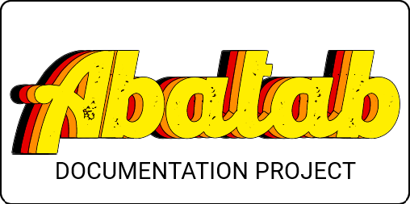

	
	<h1>
		Glossary
	</h1>

***

This is a glossary of important Abatab terms and concepts

<!--
For XML documentation:

<see href="https://spectrum-health-systems.github.io/Abatab-Documentation-Project/glossary.html#Abatab_Module">Abatab Module</see>
-->
# Abatab Module

An Abatab Module is...

 
 
 
 
 
 
 
 
 
 
 
 
 
 
 
 

<!--
For XML documentation:

<see href="https://spectrum-health-systems.github.io/Abatab-Documentation-Project/glossary.html#Abatab_Session">Abatab Session</see>
-->
# Abatab Session

An Abatab Session is...

 
 
 
 
 
 
 
 
 
 
 
 
 
 
 
 

<!--
For XML documentation:

<see href="https://spectrum-health-systems.github.io/Abatab-Documentation-Project/glossary.html#OptionObject">OptionObject</see>
-->
# OptionObject

The OptionObject is...

 

<!--
For XML documentation:

<see href="https://spectrum-health-systems.github.io/Abatab-Documentation-Project/glossary.html#Script_Parameter">Script Parameter</see>
-->
# Script Parameter

The Script Parameter is...

 
 

***

	<h6>
		This document is part of the <a href="https://spectrum-health-systems.github.io/Abatab-Documentation-Project/">Abatab Documentation Project</a>
		 
		
			Last updated: <b>November 6, 2023</b> [b231106.1057]
		
	</h6>

