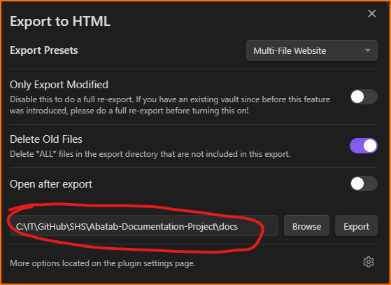
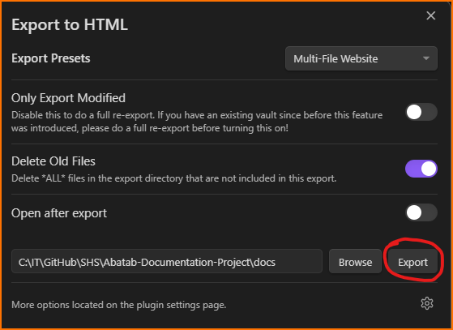

<!-- This documentation is incomplete. -->

	<h1>
		Welcome
	</h1>

***

# About the Abatab Documentation Project

The Abatab Documentation Project is a living document for [Abatab](https://github.com/spectrum-health-systems/Abatab).

The goal of the Abatab Documentation Project is to provide useful documentation for Abatab development purposes, including:

- Documentation on configuring and deploying Abatab
- Documentation and guidelines for developing Abatab
- [API documentation](https://spectrum-health-systems.github.io/Abatab/)
- TBD

The best way to view the Abatab Documentation Project is via the repository [GitHub Pages](https://spectrum-health-systems.github.io/Abatab-Documentation-Project/).

# Development

The Abatab Documentation Project is developed using [Obsidian.md](https://obsidian.md/) with the following plugins:

- [Advanced Tables](https://github.com/tgrosinger/advanced-tables-obsidian)
- [Webpage HTML Export](https://github.com/KosmosisDire/obsidian-webpage-export)

The Abatab Documentation Project also utilizes [Mermaid](https://mermaid.js.org/)).

The development source files can be found [here](https://github.com/spectrum-health-systems/Abatab-Documentation-Project/tree/development/Abatab%20Documentation).

# Release

When a new version of the Abatab Documentation Project is ready for release, you will need to deploy it and then merge the development branch with the main branch.

## Deploy

1. Click the **Webpage HTML Export** icon

2. Confirm that all necessary files/folders are included

3. Confirm that the export folder is ***docs/***

4. Click **Export**

## Merge branches

Just merge the development branch with the main branch!
