<!-- u240227 -->

 

<!-- This footer should be at the bottom of Abatab Documentation Project pages. -->

 

```mermaid
%%{init: {'theme':'dark'}}%%
gantt
  title Abatab development timeline
  dateFormat X
  axisFormat %d
  Pre-development : 0, 1d
  Code review : 3d
  Development : 23d
  Testing : 2d
  Post-development : 2d
```

***

<b>This document is part of the
[Abatab Documentation Project](https://github.com/spectrum-health-systems/Abatab-Documentation-Project)</b> 
Last updated: February 27, 2024 

