<!-- u240227 -->

<div align="center">


</div>

<br>

# Abatab development timeline

Abatab development takes place across five phases:

```mermaid
%%{init: {'theme':'dark'}}%%
flowchart LR
  Refactor -> Pre-Development --> Development --> Testing --> Release
```

1. **Refactor**  
Description

2. **Pre-development**  
Description

3. **Development**  
Description

4. **Testing**  
Description

5. **Release**  
Description




<!-- This footer should be at the bottom of Abatab Documentation Project pages. -->

<br>

```mermaid
%%{init: {'theme':'dark'}}%%
gantt
  title Abatab development
  dateFormat X
  axisFormat %d
  Refactor : 0, 5d
  Pre-Development : 2d
  Development : 20d
  Testing : 3d
  Release : 1d
```

***

<div align="center">

<b>This document is part of the
[Abatab Documentation Project](https://github.com/spectrum-health-systems/Abatab-Documentation-Project)</b><br>
Last updated: February 27, 2024<br>

</div>
