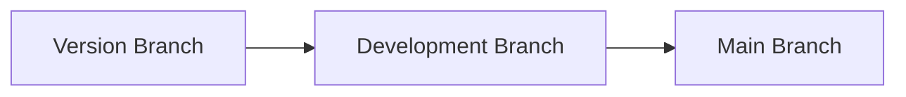
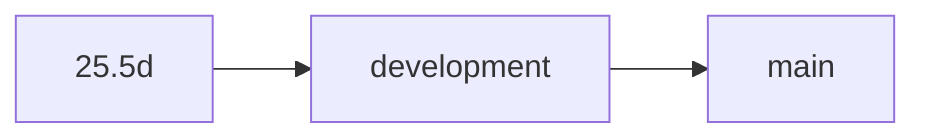

   

   
  
  **AND**
  
  

  **SO...**

  <h2>

  **DO NOT USE THIS SOURCE CODE IN PRODUCTION ENVIRONMENTS!**

  </h2>

  If you want to use Abatab in a production environment, use the [Abatab Community Release](https://github.com/spectrum-health-systems/Abatab-Community-Release).

  ***

   
  
  

   

  &nbsp;&nbsp;&nbsp;&nbsp;

 

# About this repository

This repository is for **development versions** of Abatab, which **are not intended for use in production environments**.

If you want to use Abatab in a production environment, use the [Abatab Community Release](https://github.com/spectrum-health-systems/Abatab-Community-Release).

 

# Abatab development

The current development version of Abatab is `v23.6`.

Since this a development version of Abatab:

* There probably will be broken/missing functionality!
* There definately Will have lots of ugly, gross code!
* There will be extensive comments!
* It might not even work!

 

# Development workflow

The Abatab development workflow is:

For example (and you can click on these to see where they end up):

## Version Branch

The majority of development is done in the **Version Branch**, including additions and updates to documentation.

The version branch name is the version being developed (e.g., `23.5`)

The version branch is not deployed to the web service host.

### Release types

When a version of Abatab is completed and released, the branch is renamed to `YY.MMx`, where `x` is:

* `d` for development branches that may not be fully functional
* `f` for final branches that have been tested and are fully functional

## Development branch

Once the version branch is stable, it is merged with the **Development Branch**.

This is the branch that is deployed to the web service host, and used for testing.

## Main branch

When testing functionality in the development branch is complete, it is merged with the **Main Branch**.

This is the official current development release of Abatab.

 

# Contributing

If you are interested in Abatab development, you will need:

* A location to host the Abatab which meets the following requirements:
* .NET Framework 4.8+ installed
* Access to yourmyAvatar™ environments via HTTPS
* [ScriptLink Standard](https://github.com/rcskids/ScriptLinkStandard)

 

# Additional information

For Abatab changes, please see the [development changelog](./src/docs/doc/CHANGELOG.md)

Details on upcoming Abatab functionality can be found in the [Abatab Development Roadmap](https://github.com/orgs/spectrum-health-systems/projects/25/views/2)

 

***

Abatab is developed by: 
[A Pretty Cool Program](https://github.com/APrettyCoolProgram)

